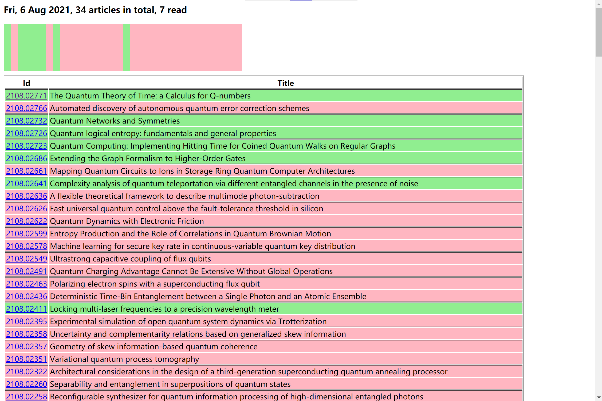

# ArXiv Librarian
*Visualizing what you have read, and will read in arXiv.*

## Introduction
Remembering articles read everyday can be painful, and that is how ArXiv Librarian comes to help. First,  let's have a look on the final effect: 


By entering the fields that you're interested in, the Librarian automatically extracts all the articles, and labels them by different colors based on whether having read or not. 

## Platform 

The program runs on Windows OS, and should have Python 3 installed. Chrome is recommended (the program relies on the history to determine which articles are read, but still it can read other format).

## How to use 

1. Download the repo and have all the packages needed installed. You can always install a package through `pip` command, e.g. 

``` 
pip install name-of-the-package 
```

2. Extract the articles from Chrome history by: 
```
python main.py -u chrome
```
You will be prompted to enter the user name so that we can infer the Chrome installation path. After running this command, a file named `data` will appear on the disk. Otherwise, you can specify a list that contains all the identifier, e.g. 
```
2007.07419
2107.10677
2107.12936
2107.12975
2107.13343
2107.13360
```
save it as `list`, and update articles read by: 
```
python main.py -u list
```

3. Download the article of interested field from arXiv announced within a week by 
``` 
python main.py -u arxiv 
```
You will be prompted to enter the field code (e.g. `quant-ph`, `stat`). Enter one field code at a time. The commanded may by called many times to add all interested fields. After running this command, a file named `arxiv` will appear on the disk. 

4. Output the final report in HTML format by 
``` 
python main.py -o 
```
This will generate a file named `output.html`, and we're done. 


## Getting help

Running 
```
python main.py -h
``` 
will generate a concise yet complete help. Also, [Issue](https://github.com/putian9935/ArXiv-Librarian/issues) is good place to post issues. 
